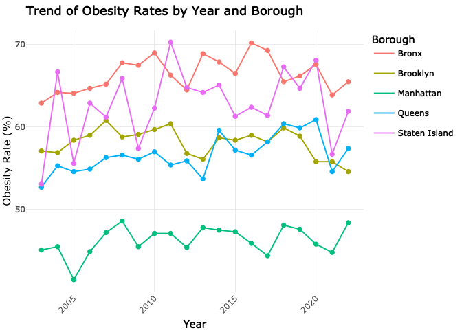

final data for overweight
================
Anni Wang
2024-12-04

``` r
#import and clean data
overweight2022_df = 
  read.csv("data/overweight2022.csv", na = c("NA",".","")) |> 
   janitor::clean_names()

overweight_df <- read_csv("data/overweight2022.csv") %>%
  clean_names() %>%
  mutate(
    obesity_rate_raw = percent,  
    percent_numeric = sub("\\s*\\(.*$", "", percent),  
    obesity_rate = as.numeric(percent_numeric),  
    number_clean = as.numeric(gsub(",", "", number))  
  ) %>%
  filter(geo_type_desc == "Borough") %>%
  select(-percent_numeric)  
```

    ## Rows: 40 Columns: 7
    ## ── Column specification ────────────────────────────────────────────────────────────────────────────────────────────────────────────
    ## Delimiter: ","
    ## chr (4): GeoTypeDesc, Geography, Number, Percent
    ## dbl (3): TimePeriod, GeoID, GeoRank
    ## 
    ## ℹ Use `spec()` to retrieve the full column specification for this data.
    ## ℹ Specify the column types or set `show_col_types = FALSE` to quiet this message.

    ## Warning: There were 2 warnings in `mutate()`.
    ## The first warning was:
    ## ℹ In argument: `obesity_rate = as.numeric(percent_numeric)`.
    ## Caused by warning:
    ## ! NAs introduced by coercion
    ## ℹ Run `dplyr::last_dplyr_warnings()` to see the 1 remaining warning.

``` r
na_check <- overweight_df %>% filter(is.na(obesity_rate))
print(na_check)
```

    ## # A tibble: 0 × 10
    ## # ℹ 10 variables: time_period <dbl>, geo_type_desc <chr>, geo_id <dbl>,
    ## #   geo_rank <dbl>, geography <chr>, number <chr>, percent <chr>,
    ## #   obesity_rate_raw <chr>, obesity_rate <dbl>, number_clean <dbl>

``` r
overweight_overall_df <- read_csv("data/overweightoverall.csv") %>%
  clean_names() %>%
  mutate(
    obesity_rate = as.numeric(sub("\\s*\\(.*$", "", percent)),  
    geo_type = tolower(geo_type)  
  ) %>%
  filter(geo_type == "borough")  
```

    ## Rows: 800 Columns: 7
    ## ── Column specification ────────────────────────────────────────────────────────────────────────────────────────────────────────────
    ## Delimiter: ","
    ## chr (4): GeoType, Geography, Number, Percent
    ## dbl (3): TimePeriod, GeoID, GeoRank
    ## 
    ## ℹ Use `spec()` to retrieve the full column specification for this data.
    ## ℹ Specify the column types or set `show_col_types = FALSE` to quiet this message.

    ## Warning: There was 1 warning in `mutate()`.
    ## ℹ In argument: `obesity_rate = as.numeric(sub("\\s*\\(.*$", "", percent))`.
    ## Caused by warning:
    ## ! NAs introduced by coercion

``` r
overweight2022_df <- overweight2022_df %>%
  mutate(obesity_rate = as.numeric(sub("\\s*\\(.*\\)$", "", percent))) 
```

    ## Warning: There was 1 warning in `mutate()`.
    ## ℹ In argument: `obesity_rate = as.numeric(sub("\\s*\\(.*\\)$", "", percent))`.
    ## Caused by warning:
    ## ! NAs introduced by coercion

``` r
borough_data <- overweight2022_df %>%
  filter(geo_type_desc == "Borough")

# Find the borough with the highest obesity rate
borough_with_highest_obesity <- borough_data %>%
  filter(obesity_rate == max(obesity_rate))
print(borough_with_highest_obesity)
```

    ##   time_period geo_type_desc geo_id geo_rank geography  number           percent
    ## 1        2022       Borough      1        1     Bronx 693,000 65.5 (61.7, 69.0)
    ##   obesity_rate
    ## 1         65.5

Bronx has the highest overweight rate in 2022.

``` r
#interactive plot for Obesity Rates and Numbers by Borough in NYC, 2022
library(ggplot2)
library(plotly)

obesity_plot <- ggplot(overweight_df, aes(x = geography, y = obesity_rate, fill = geography)) +
  geom_bar(stat = "identity", color = "black") +
  geom_text(aes(label = number_clean),  
            vjust = -0.5, size = 4) +  
  labs(title = "Obesity Rates and Numbers by Borough in NYC, 2022",
       x = "Borough",
       y = "Obesity Rate (%)",
       fill = "Borough") +
  theme_minimal() +
  theme(axis.text.x = element_text(angle = 45, hjust = 1))

interactive_plot <- ggplotly(obesity_plot)
interactive_plot
```

<!-- -->

``` r
# Create a line plot to show the trend of obesity rates by year for each borough
obesity_trend_plot <- ggplot(overweight_overall_df, aes(
  x = time_period,
  y = obesity_rate,
  group = geography,
  color = geography
)) +
  geom_line() +
  geom_point(aes(
    text = paste(
      "Borough:", geography,
      "<br>GeoID:", geo_id,
      "<br>Year:", time_period,
      "<br>Rate:", obesity_rate
    )
  )) +  
  labs(
    title = "Trend of Obesity Rates by Year and Borough",
    x = "Year",
    y = "Obesity Rate (%)",
    color = "Borough"
  ) +
  theme_minimal() +
  theme(axis.text.x = element_text(angle = 45, hjust = 1))
```

    ## Warning in geom_point(aes(text = paste("Borough:", geography, "<br>GeoID:", :
    ## Ignoring unknown aesthetics: text

``` r
# Convert ggplot to interactive plotly plot and enable custom tooltip
interactive_trend_plot <- ggplotly(obesity_trend_plot, tooltip = "text")

# Print the interactive plot
interactive_trend_plot
```

<!-- -->
