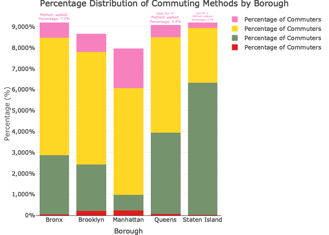

final
================

loading necessary package

import commuting dataset

``` r
commuting_df = 
  read.csv("data/commuting.csv", na = c("NA",".","")) |> 
   janitor::clean_names()
```

transfer datatype to numeric, filter by borough, using total number for
each commuting mode

``` r
borough_df = 
  commuting_df  |> 
  filter(geo_type_desc == "Borough") |> 
  mutate(
    across(c(bicycle_number, car_truck_or_van_number, public_transportation_number, walked_number),
                ~as.numeric(gsub(",", "", .))))
```

using long table to list the commuting mode for each borough

``` r
commute_long <- pivot_longer(borough_df, 
                             cols = c(bicycle_number, car_truck_or_van_number, public_transportation_number, walked_number), 
                             names_to = "Method", 
                             values_to = "Count",
                             names_pattern = "(.*)_number")  
```

data explore for some graphs

``` r
p1_plotly <- plot_ly(data = commute_long, x = ~geography, y = ~Count, type = 'bar', color = ~Method, colors = RColorBrewer::brewer.pal(8, "Set2"),
                     hoverinfo = 'text', text = ~paste("Borough: ", geography, "<br>Geo ID: ", geo_id, "<br>Method: ", Method, "<br>Count: ", Count),
                     name = 'Count of Commuters') %>%
  layout(title = 'Commuting Methods by Borough',
         xaxis = list(title = 'Borough'),
         yaxis = list(title = 'Count of Commuters'),
         barmode = 'group')

p1_plotly 
```

<!-- -->

do the same for commuting modes percent

``` r
commute_percent_long <- pivot_longer(borough_df, 
                                     cols = c(bicycle_percent, car_truck_or_van_percent, public_transportation_percent, walked_percent), 
                                     names_to = "Method", 
                                     values_to = "Percent",
                                     names_pattern = "(.*)_percent")
```

``` r
p2_plotly <- plot_ly(data = commute_percent_long, x = ~geography, y = ~Percent, type = 'bar', color = ~Method, colors = RColorBrewer::brewer.pal(8, "Set1"),
                     hoverinfo = 'text', text = ~paste("Borough: ", geography, "<br>Geo ID: ", geo_id, "<br>Method: ", Method, "<br>Percentage: ", sprintf("%.1f%%", Percent)),
                     name = 'Percentage of Commuters') %>%
  layout(title = 'Percentage Distribution of Commuting Methods by Borough',
         xaxis = list(title = 'Borough'),
         yaxis = list(title = 'Percentage (%)', tickformat = ",.0%"),
         barmode = 'stack')

p2_plotly
```

<!-- -->

we can see from the bar chart, public transportation is the most popular
commuting mode in most borough, except for the Staten Island, where the
car/cruck/van is the most popular commuting mode.
